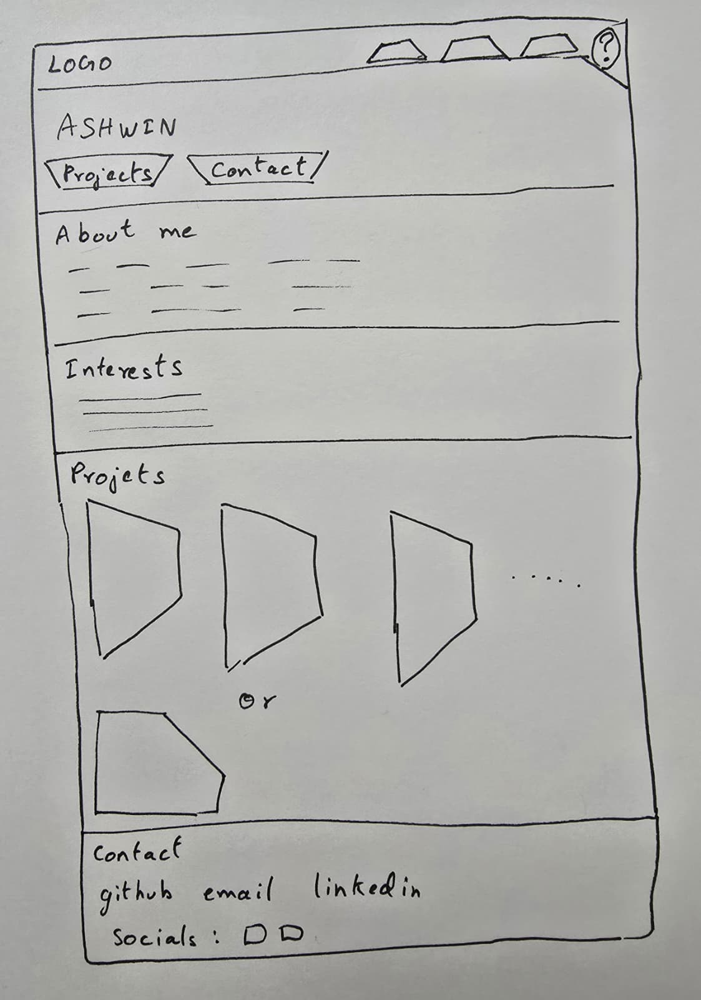
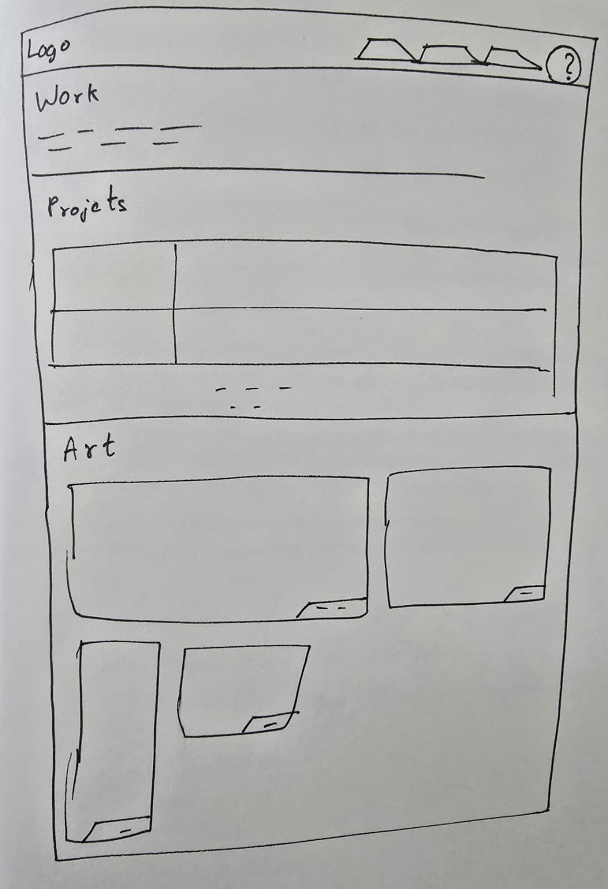
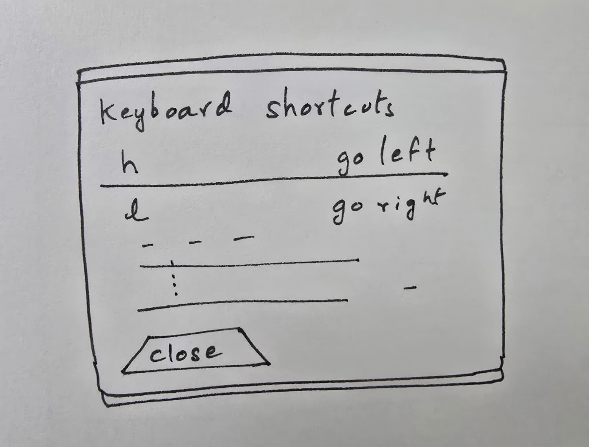

# Design document

## The project

A personal site for myself. It runs entirely in the browser without the use of any component library or framework. Plain HTML, CSS, and JavaScript.

There are three pages. **Home** is the introduction and a short list of the
projects I have made. **Work** has the longer project write-ups and a gallery
of my ink sketches and pixel art. **Lab** is a page I had a language model
generate entirely.

The thing that makes this project unique is the keyboard layer. `h`
and `l` move between pages, `gg` jumps to the top, and `?` opens a list of the
shortcuts. It comes out of my love for vim and it's keyboard motions. In vim, `h` and `l` move the cursor left and right and `gg` moves the cursor to the beginning of the page. This feature mimics these motions.

## Visual language

1. **Trapezoids** Nav tabs, buttons, tags, and captions are all
   cut shapes rather than rounded boxes.
   The cuts are done with `clip-path`, since CSS has no
   trapezoid of its own.
2. **A muted palette.** `#161719`, `#1D1E21`, `#34363A`, `#9E9C96`,
   `#D8D5CE`, and a dull sage `#8E998B`. Nothing brighter than the sage, and it
   is only used for accents.

The palette is deliberately muted so that my artwork on the Work page is the
only real color on the site. That's the whole reason for it. Also of course, a muted palette looks more sleek and modern.

## Who it's for

### Richard, 34, technical recruiter

Screens student portfolios all day and gives each one about half a minute
before deciding whether to keep reading. He wants three facts fast: what he
builds, whether there's code he can look at, and how to get in touch. He is
usually on a laptop, often with fifteen other tabs open.

### Josh, 21, CS student

Found learn.nvim on GitHub, liked it, and clicked through to see who wrote it.
He actually reads the project descriptions, and he'll open the repos. He's the
person most likely to notice the keyboard shortcuts, and the most likely to be
pleased by them. He might be on a phone.

### Priya, 26, indie game developer

Looking for someone to work with on a game jam and following a link a friend
sent her. What she needs to answer is whether one person here can both draw and
program, so she goes looking for the art first. If the images are slow or
scaled badly, she'll assume the art isn't the point and leave.

## User stories

**Richard, in a hurry**

- As a recruiter, I want to know what he does within a few seconds of the page
  loading, so I can decide whether to keep reading.
- As a recruiter, I want his projects listed with a one-line description each,
  so I don't have to read paragraphs to work out what they are.
- As a recruiter, I want his email and GitHub visible without hunting, so I can
  contact him or move on.
  the half minute I'm giving it isn't spent watching a spinner.

**Josh, curious**

- As a developer, I want each project to link to its repository, so I can read
  the source.
- As a developer, I want the longer write-ups on their own page, so Home stays
  short for people who don't want them.
- As a keyboard user, I want to move between pages without reaching for the
  mouse, so browsing the site feels like using my editor.
- As a first-time visitor, I want to find out those shortcuts exist, so I'm not
  expected to guess them. (Hence `?`, and the button in the corner.)

**Priya, looking for an artist**

- As a collaborator, I want to see a decent amount of the art in one scroll, so
  I can judge the range rather than one piece.
- As a collaborator, I want the pixel art to stay sharp instead of being
  smoothed by the browser, so it looks the way it was drawn.

**Everyone**

- As a screen reader user, I want every image described and every control to be
  a real button or link, so the site is usable without seeing it.

## Wireframes

### Home



Header with the brand tab and three nav tabs. Hero with name, one-line intro,
and two buttons. Then About, a short "interests" section, projects, and contact details at the bottom.

### Work



Title and one line of introduction. Projects as rows: name and type on the
left, description and repo link on the right. Below that, the art gallery,
with one wide piece across the top and the rest in a grid.

### Lab

A simple wireframe for the Lab page:

```text
[ Header / Navigation ]

[ Lab introduction ]

[ Main generated content ]

[ Interactive controls ]

[ Footer ]
```

This keeps the third page represented in the design mockups alongside Home and Work.

### Shortcut dialog



The panel `?` opens: one row per shortcut, key on the left, what it does on the
right, and a close button.
